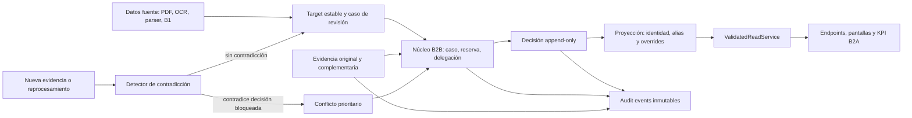
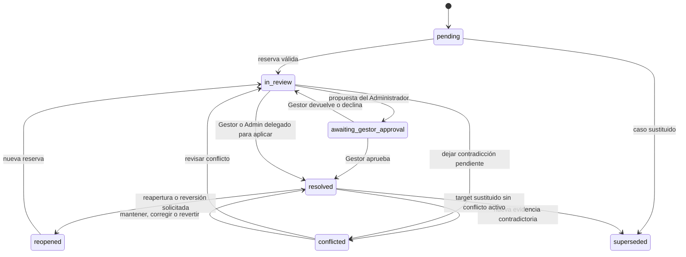
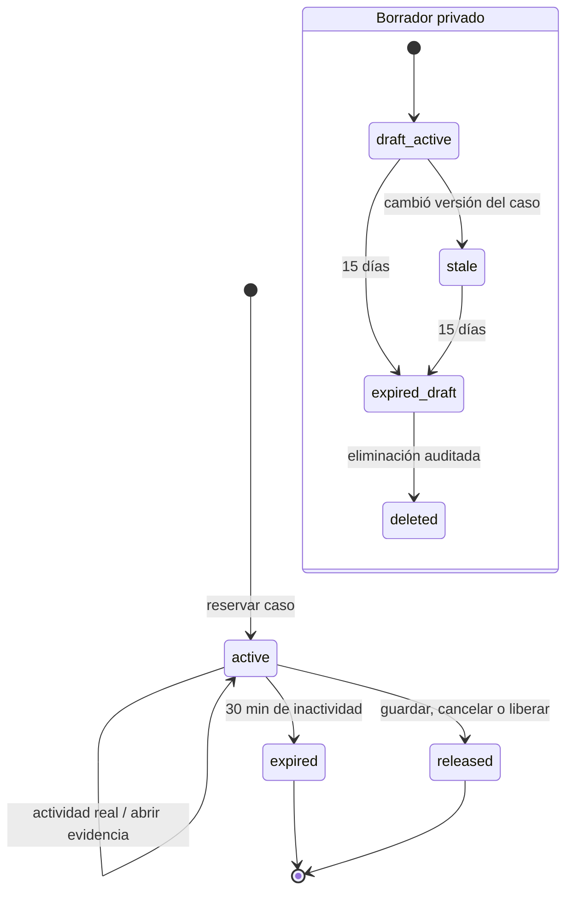
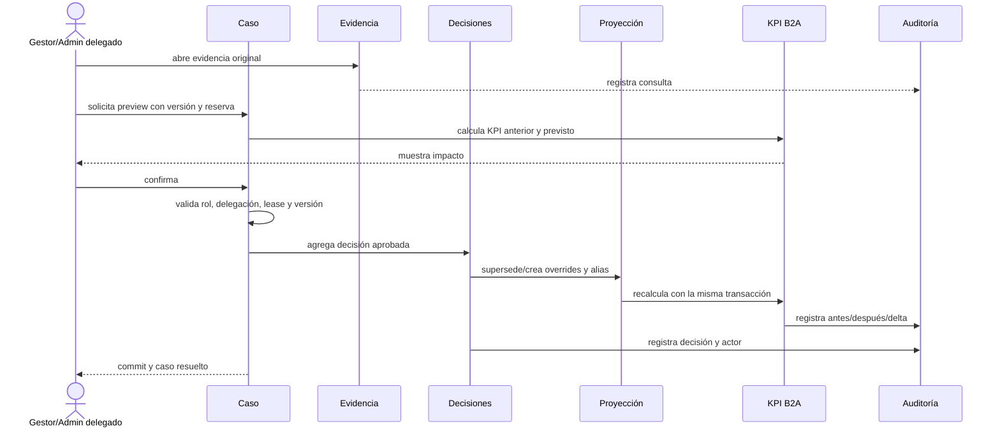
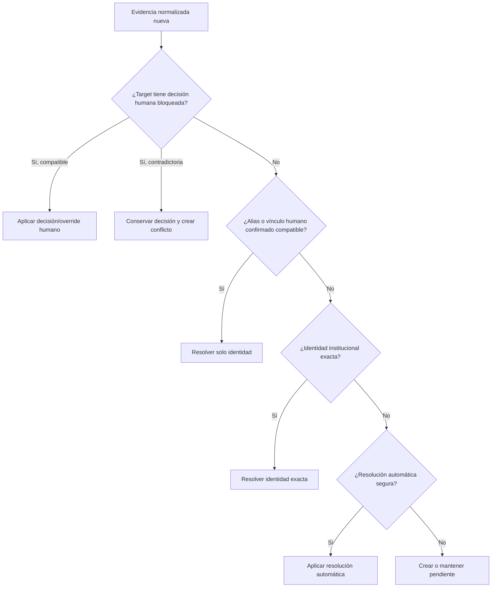

# B2B: Revisión humana, decisiones y evidencia

**Fecha:** 2026-07-13  
**Estado:** aprobada; B2B.1 ejecutada y en cierre formal mediante Task 15  
**Alcance de este documento:** investigación, arquitectura y diseño. No autoriza código, migraciones, modelos, endpoints, pruebas, frontend, escrituras en PostgreSQL ni reprocesamiento.

## 1. Objetivo y principios no negociables

B2B incorporará un proceso humano auditable para resolver identidades, autores, productos, directores, instituciones y texto inválido sin destruir la evidencia de origen ni alterar silenciosamente B1/B2A.

Principios:

1. El **Gestor de Investigación** es la máxima autoridad funcional y propietario del proceso.
2. El **Administrador** es soporte técnico. Solo modifica datos científicos mediante una delegación explícita, vigente y limitada a un caso.
3. Una decisión humana confirmada prevalece sobre parser, OCR, resolver, backfill, normalización y reprocesamiento.
4. Los datos crudos y las versiones históricas son inmutables. Las decisiones humanas se guardan por separado.
5. Alias e identidades confirmadas pueden reutilizarse globalmente; roles, autorías, productos, proyectos, relaciones, estados, periodos y KPI mantienen alcance local.
6. La decisión, su proyección operativa y el cálculo de impacto KPI se confirman en una sola transacción.
7. Reabrir o revertir nunca borra historia: agrega una decisión y eventos nuevos relacionados con los anteriores.
8. La auditoría es append-only y se conserva indefinidamente.
9. B2B usa el modelo relacional vigente y una proyección síncrona. No introduce event sourcing completo.

Nunca pueden ser targets de un override ni de una corrección destructiva: `raw_name`, `raw_author_name`, título crudo, `person_key` original, `import_job_id`, `production_id`, `research_entity_id`, `parsed_payload`, OCR trace, documento original, página, sección, bounding box, evidencia extraída y versiones históricas. La interfaz siempre muestra valor original, valor operativo vigente, decisión aplicada, evidencia y usuario responsable.

## 2. Inventario del sistema actual

### 2.1 Arquitectura

- Backend FastAPI organizado en `api`, `schemas`, `services`, `models` y `core`.
- SQLAlchemy sobre PostgreSQL.
- Migraciones mediante el runner ordenado `schema_migrations`; no se usa Alembic CLI. La cabeza vigente documentada es `20260712_0016_canonical_identity_fields`.
- Next.js/React consume los endpoints FastAPI y conserva JWT y perfil en `localStorage`.
- MinIO almacena evidencias cargadas manualmente.
- Dropbox y n8n alimentan importaciones PDF; `import_jobs` mantiene revisión, identidad lógica del documento, versión vigente y cadena `supersedes_id`.
- `ValidatedReadService` es la frontera operativa central para datos vigentes y exitosos.

### 2.2 Autenticación, usuarios y permisos actuales

- JWT HS256 con `sub=email`, `role` y expiración; la identidad efectiva se vuelve a consultar en `users` y debe estar activa.
- Roles actuales: `FACULTY_ADMIN` y `CAREER_MANAGER`.
- `FACULTY_ADMIN` concentra importación, diagnósticos, trazas y operaciones administrativas.
- `CAREER_MANAGER` queda limitado a su carrera en lecturas y mutaciones existentes.
- La importación automatizada admite `x-api-key` y se identifica como actor `n8n`.
- No existe todavía el rol técnico subordinado requerido por B2B, ni delegación por caso, capacidades por acción, reservas o aprobación de propuestas.
- B2B no debe reutilizar ambiguamente `FACULTY_ADMIN` para dos autoridades distintas. Conceptualmente se requieren las capacidades `RESEARCH_MANAGER` (Gestor) y `SYSTEM_ADMIN` (Administrador). La asignación de cuentas existentes será explícita; nunca se inferirá por correo o actividad previa. `CAREER_MANAGER` conserva su alcance B2A y no obtiene permisos B2B.

### 2.3 Persistencia actual relevante

El respaldo pre-B2A confirma las tablas:

- Organización y acceso: `faculties`, `careers`, `users`, `academic_periods`.
- Datos científicos: `teachers`, `external_researchers`, `research_projects`, `project_teachers`, `research_entities`, `scientific_productions`, `scientific_production_authors`, `person_roles`, `annual_goals`.
- Ingesta y trazabilidad: `import_batches`, `import_jobs`, `imported_research_records`, `imported_project_participants`, `imported_progress_reports`, `imported_ocr_traces`, `import_normalization_audits`, `import_review_items`.
- Infraestructura de migraciones: `schema_migrations`.

Campos de evidencia distribuidos por las tablas normalizadas incluyen `import_batch_id`, `import_job_id`, `source_file`, `source_page`, `source_section`, `raw_value`, `normalized_value`, `confidence_score`, `parser_version`, motivos y metadatos JSON.

### 2.4 B1: identidad canónica persistida

La revisión 0016 añadió a `person_roles` y `scientific_production_authors`:

- `canonical_identity_key`, `canonical_name`;
- `identity_source`, `identity_confidence`, `identity_reason`;
- `identity_locked`, `identity_decided_by`, `identity_decided_at`.

B1 preservó datos crudos y produjo una línea base verificada:

- 163 filas operativas: 120 roles y 43 autores;
- 54 identidades canónicas;
- 53 filas con decisión canónica pendiente;
- tres consolidaciones automáticas aprobadas;
- dos productos elegibles KPI.

Los campos de bloqueo preparan decisiones manuales, pero no existe un flujo para crearlas. El backfill respeta `identity_locked=true`; sin embargo, una reconstrucción destructiva de normalización elimina filas de roles y autores, de modo que una decisión durable no puede depender únicamente de esos campos.

### 2.5 B2A/B2A.1: lectura operacional

B2A hace que `ValidatedReadService` consuma las claves canónicas persistidas y expone:

- 54 identidades totales y 49 visibles;
- 83 participaciones persona-documento totales y 78 visibles;
- 19 productos: 2 elegibles y 17 pendientes;
- 5 externos detectados: 1 validado y 4 pendientes;
- 7 proyectos con estado de identidad del director y estado de relación separados;
- posibles coincidencias informativas entre nombres pendientes iguales.

B2A no edita ni aprueba datos. Sus endpoints y KPI son proyecciones relacionales síncronas; esta característica permite que una proyección B2B transaccional sea visible inmediatamente sin una infraestructura asíncrona.

### 2.6 Trazas, PDFs y evidencia disponibles

- `imported_ocr_traces` conserva texto extraído, payload parseado, proveedor, confianza, estado global y datos de revisión de traza.
- `import_normalization_audits` registra la transformación parser → fila normalizada.
- `import_review_items` recibe logs de baja confianza, pero solo contiene el candidato: no tiene estado, responsable, versión, decisión, delegación, rollback ni historial. Además, el reprocesamiento normalizado lo elimina y reconstruye.
- El endpoint de revisión OCR solo sobrescribe el estado y las notas de una traza; no produce historial inmutable ni correcciones por campo.
- Los PDFs fuente inspeccionados son digitales, no cifrados y contienen texto: GINFAES (8 páginas), Tributaria (8), Ramírez (19) y Zambrano (10).
- Los archivos fuente se recuperan desde Dropbox con autenticación y pueden abrirse por trabajo o por reporte de progreso.
- La carga MinIO actual acepta un archivo, deduce `.pdf` por el nombre, crea un objeto UUID y devuelve una URL. No persiste hash, MIME real, tamaño, relaciones con casos, pertinencia, retiro, sustitución, cuarentena ni auditoría.
- `ScientificProduction.evidence_url` es solo una URL; no constituye un expediente de evidencia.
- Los reportes PDF/XLSX actuales contienen KPI, no auditoría B2B ni paquetes de evidencia.

### 2.7 Capacidades reutilizables y nueva persistencia necesaria

| Capacidad | Reutilizable ahora | Nueva persistencia necesaria |
|---|---|---|
| Login, sesión, usuario activo | JWT, `users`, dependencias de rol | Capacidades Gestor/Administrador y asignación explícita de cuentas |
| Alcance por carrera | Restricciones de `CAREER_MANAGER` | Ningún permiso B2B para este rol |
| Identidad y procedencia | Campos B1, claves canónicas, filas raw, source locators | Registro durable de identidades creadas, alias y decisiones |
| Lectura operacional | `ValidatedReadService` y KPI síncrono | Overlay de overrides humanos y cálculo previo/posterior |
| Casos candidatos | Pendientes B1/B2A e `import_review_items` | Casos con estado, prioridad, versión y responsable |
| Evidencia original | Dropbox, PDF, página, sección, texto y payload | Registro obligatorio de apertura y vínculo con la decisión |
| Evidencia complementaria | MinIO básico | Metadatos, hash, deduplicación, seguridad, vínculos e historial |
| Auditoría | Trazas y normalización parciales | Ledger inmutable transversal |
| Concurrencia | Advisory lock en persistencia de importación | Reserva por caso y versionado optimista |
| Reprocesamiento | Documento vigente, `supersedes_id`, raw y payload | Precedencia humana, matching estable y conflictos |
| Rollback | Backups, snapshots e invariantes B1 | Reversión funcional append-only y restore B2B |
| Exportación | PDF/XLSX KPI | Auditoría filtrada y ZIP temporal de evidencias |

## 3. Alternativas arquitectónicas

### 3.1 Comparación

| Criterio | A. Núcleo genérico | B. Tablas por dominio | C. Eventos + proyección |
|---|---|---|---|
| Forma | `review_items`, `review_decisions`, `field_overrides`, `person_aliases`, evidencia y auditoría comunes | Flujos separados para personas, autores, productos, directores, etc. | Todo cambio es evento; el estado se reconstruye en proyecciones |
| Ventajas | Flujo uniforme, reutiliza B1/B2A, una sola política de permisos/concurrencia, crecimiento controlado | Esquema explícito y validación simple dentro de cada dominio | Máxima reconstrucción temporal, replay y trazabilidad teórica |
| Riesgos | Payloads genéricos mal tipados o targets ambiguos | Duplicación de reglas, estados divergentes y muchas uniones | Complejidad de versiones de eventos, replay, consistencia y operación |
| Complejidad | Media; mitigable con tipos de caso, payloads versionados y restricciones | Alta y creciente con cada acción/dominio | Muy alta; exige disciplina y herramientas que el proyecto no tiene |
| Mantenimiento | Centralizado; una mejora beneficia todas las bandejas | Cada cambio se repite en varias tablas, servicios y pantallas | Cambios deben mantener compatibilidad de eventos y proyecciones antiguas |
| Auditoría | Fuerte con decisiones y `audit_events` append-only | Posible, pero fragmentada por dominio | Excelente por naturaleza |
| Rollback | Nueva decisión de reversión + superseded overrides; restore de backup para desastre | Lógica distinta por dominio | Evento compensatorio y replay, operacionalmente más difícil |
| Concurrencia | Una reserva y versión por caso | Reservas y versiones repetidas por dominio | Control por versión de agregado y posición de stream |
| Reprocesamiento | Target estable + alias global + override local + conflicto | Matching y precedencia repetidos por dominio | Replay natural, pero integrar fuentes mutables requiere gran rediseño |
| Rendimiento | Índices relacionales y proyección síncrona compatible con B2A | Consultas directas, a costa de numerosas uniones entre flujos | Lectura rápida si la proyección está sana; reconstrucción costosa |
| Frontend | Bandejas y detalle reutilizables con paneles tipados | Componentes y contratos distintos por dominio | Frontend simple contra proyección; operación de proyección compleja |
| Pruebas | Matriz común + contratos por tipo | Gran matriz repetida | Pruebas de eventos, replay, orden, idempotencia y proyección |
| Integración B1/B2A | Incremental: overlay sobre la frontera actual | Intrusiva en varios servicios | Sustituye la fuente operacional y obliga a reescribir B2A |

### 3.2 Recomendación

Se recomienda **A: núcleo genérico con decisiones append-only y proyección operacional síncrona**.

No es event sourcing: `audit_events` conserva historia, pero no es la única fuente para reconstruir toda la aplicación. El estado vigente está en casos, identidades, alias y overrides; `ValidatedReadService` los aplica sobre B1. Esto aporta auditoría, reversión y precedencia humana sin introducir broker, replay global, consistencia eventual ni versionado de streams.

Las tablas auxiliares de delegación, reserva, borrador, evidencia, conflicto, KPI y exportación son comportamientos transversales, no tablas científicas específicas por dominio. Los payloads de decisión serán tipados y versionados por `case_type`; no se aceptará JSON arbitrario.

## 4. Arquitectura recomendada

### 4.1 Límites de responsabilidad

1. **Registro de casos:** convierte pendientes actuales en unidades revisables, identifica su target estable, prioridad, estado y versión.
2. **Autorización funcional:** valida rol, delegación, modalidad, acciones y restricciones excepcionales.
3. **Coordinación:** administra reserva, actividad real, expiración, versión y borrador privado.
4. **Decisiones:** conserva propuestas y decisiones confirmadas sin actualización destructiva.
5. **Proyección:** materializa solo el estado vigente mediante identidad, alias y overrides bloqueados.
6. **Evidencia:** administra objetos físicos deduplicados, vínculos por caso, pertinencia y seguridad.
7. **KPI:** usa la misma lógica B2A para simular y confirmar valores antes/después.
8. **Conflictos:** compara nueva evidencia con decisiones humanas y evita cambios silenciosos.
9. **Auditoría y exportación:** registra todos los actos y produce expedientes filtrados.

### 4.2 Target estable

Las decisiones no se identificarán solo por IDs de filas que un reprocesamiento puede recrear. Cada caso tendrá:

- `target_type` y el ID relacional actual cuando exista;
- `document_key` y revisión de origen;
- `source_section`, `source_page`, `row_or_block_id`, `field_path` y bounding box cuando exista;
- hash del valor crudo normalizado exclusivamente para correlación;
- `stable_target_key` de hasta 128 caracteres, derivada de esos componentes sin eliminar los IDs originales.

La fórmula estable es exactamente `b2b:v1:{case_type.value}:{sha256_hex}`. `sha256_hex` conserva los 64 caracteres hexadecimales minúsculos completos; no se trunca el digest, no se abrevia `case_type` y no se hashea el prefijo. `target_pk` se conserva como localizador informativo y es el único campo del modelo excluido del material canónico.

Una coincidencia exacta permite reaplicar un override local. Una coincidencia parcial o evidencia cambiada genera conflicto o caso nuevo; nunca hereda silenciosamente una corrección.

## 5. Modelo conceptual de datos

No se incluye SQL. Todos los timestamps se almacenan con zona horaria; todas las entidades mutables llevan `version` entero para control optimista.

### 5.1 Núcleo de revisión

| Tabla | Columnas principales | Claves, índices y restricciones |
|---|---|---|
| `review_items` | `id`, `case_type`, `stable_target_key VARCHAR(128)`, target relacional opcional, localizadores de documento con `row_or_block_id TEXT`, `case_status`, `scientific_status`, prioridad automática/manual, posible impacto KPI, responsable, `current_decision_id`, `version`, fechas | PK UUID; índice por bandeja `(case_type, case_status, priority, created_at)`; índice por responsable; unicidad de caso activo por tipo + target estable; FK diferible a decisión vigente |
| `review_decisions` | `id`, `review_item_id`, secuencia, `decision_type`, `decision_lifecycle`, scope, payload tipado/versionado que contiene los snapshots anterior/nuevo, motivo, evidencia insuficiente y limitación, política KPI, actor/rol, delegación, aprobador, fechas, decisión/evento previo, `expected_case_version`, apertura de evidencia obligatoria | Append-only; los snapshots viven dentro del JSONB `payload`, no en columnas separadas; secuencia única por caso; FK a caso/usuario/delegación/evidencia; una sola decisión `approved` vigente por secuencia lógica; no UPDATE/DELETE para rol de aplicación |
| `field_overrides` | `id`, caso, decisión, `stable_target_key VARCHAR(128)` y target relacional, `field_path`, valor proyectado, scope, documento/periodo/relación, `locked`, `active`, vigencia, `superseded_by_id`, `version` | Un override activo por target + campo + scope; FK a decisión aprobada; índice de lectura por target; raw fields prohibidos como `field_path` |
| `canonical_identities` | `id`, `canonical_identity_key`, tipo, nombre visible, estado, origen humano/B1, decisión creadora, `superseded_by_id`, `version` | Clave canónica única; no contiene cédula, correo ni datos privados; una identidad fusionada apunta a la vigente sin borrar historia |
| `person_aliases` | `id`, alias original/normalizado, identidad, alcance global de identidad, decisión, estado, vigencia, `superseded_by_id`, `version` | Índice único activo por alias normalizado + clase compatible; conflicto si el mismo alias intenta apuntar a dos identidades; no almacena roles ni KPI |
| `review_action_batches` | `id`, actor, delegación, tipo de acción de bajo riesgo, motivo común, cantidad prevista/aplicada, estado, fechas | Solo tipos masivos permitidos; correlaciona decisiones y auditoría individuales; transacción única |

Los tipos de caso mínimos son: `person_identity`, `author_identity`, `product`, `project_director_relation`, `external_identity`, `possible_duplicate`, `invalid_text` y `new_evidence_conflict`.

El ciclo de una decisión tampoco se implementa actualizando una fila. Una propuesta permanece `proposed`; aprobarla, declinarla, supersederla o revertirla agrega otra fila relacionada y mueve únicamente el puntero proyectado `current_decision_id`. Así, propuesta y resultado se conservan completos.

`projection_before` y `projection_after` son snapshots cerrados, congelados y versionados dentro de `review_decisions.payload`. Conservan estados de caso/ciencia, puntero vigente, identidad/aliases activos y la definición tipada completa de cada override restaurable. Ambos están presentes o ambos ausentes; una decisión aprobada que bloquee proyección exige ambos y una reversión siempre los exige. Alias y overrides se ordenan canónicamente y rechazan duplicados. No contienen raw, parser/OCR, evidencia, roles, productos, autorías, relaciones, periodos ni KPI como datos anexos. Esta decisión usa el JSONB existente: no agrega columnas, tablas ni migración.

### 5.2 Coordinación y autoridad

| Tabla | Columnas principales | Restricciones |
|---|---|---|
| `review_delegations` | caso, Gestor, Administrador, modalidad `apply/propose`, acciones autorizadas, motivo, inicio, límite, estado, revocación/resolución, `version` | Caso concreto; el Administrador no puede ser delegante ni ampliar acciones; una delegación activa aplicable por caso/administrador; expiración y resolución automáticas |
| `review_reservations` | caso, usuario, token de lease, inicio, última actividad real, aviso, expiración, estado, liberador, `version` | Una reserva activa por caso; 30 minutos; actividad real requerida; índice por expiración |
| `review_drafts` | caso, propietario, delegación opcional, `base_case_version`, contenido privado, estado, fechas, expiración y aviso | Único borrador activo por caso/usuario; 15 días; acceso por propietario y Gestor solo si deriva de delegación; nunca participa en proyección/KPI |

### 5.3 Evidencia y seguridad

| Tabla | Columnas principales | Restricciones |
|---|---|---|
| `evidence_assets` | hash SHA-256, storage key, nombre, extensión declarada/real, MIME declarado/real, tamaño, descripción, motivo, uploader, estado funcional, estado de seguridad, metadatos estructurales, cuarentena y purga | Hash físico único; máximo 20 MB; formatos PDF/JPG/PNG/DOCX/XLSX; objetos válidos no se eliminan físicamente |
| `review_evidence_links` | caso, asset, propósito, estado de pertinencia, usuario/fecha, decisión respaldada, vínculo sustituido, retiro/sustitución y motivo, `version` | Un asset puede vincularse a varios casos; estado independiente por vínculo; retirar un vínculo no afecta otros |
| `evidence_security_reviews` | asset, revisor técnico, resultado, motivo, hallazgos, solicitud del Gestor, falso positivo, fechas, evento previo | Append-only; liberar técnicamente no valida pertinencia funcional |
| `review_evidence_accesses` | caso, asset o documento fuente, usuario, fecha, página, sección, fragmento, acción `open/download`, reserva | Append-only; una decisión de riesgo referencia una apertura vigente del mismo caso y usuario |

### 5.4 Conflictos, KPI, auditoría y exportación

| Tabla | Columnas principales | Restricciones |
|---|---|---|
| `review_conflicts` | caso, decisión vigente, evidencia anterior/nueva, diff tipado, impacto KPI posible, prioridad, estado, detección y resolución | Un conflicto activo por decisión + evidencia contradictoria; no desactiva la decisión vigente |
| `review_kpi_impacts` | decisión, métrica, periodo/carrera, valor anterior/posterior/delta, regla aplicada | Se escribe con la decisión aprobada; índices por métrica, periodo e impacto distinto de cero |
| `audit_events` | id, tipo, caso, agregado/id, usuario/rol, fecha, versión, anterior/nuevo, motivo, evidencia, delegación, KPI, evento anterior, correlación/lote/exportación, request id, hash de evento | Append-only, sin UPDATE/DELETE; índices por fecha, usuario, caso, tipo, delegación, conflicto y evidencia; conservación indefinida |
| `review_exports` | solicitante, filtros, formato, confirmación, cantidad/tamaño, estado, storage key, expiración, descargas, error, fechas | PDF/XLSX/ZIP; ZIP autenticado, sin cuarentena, expira en 24 horas; generación, descarga y eliminación auditadas |

### 5.5 Fusiones, separaciones y reversión

- **Fusionar:** una decisión `merged` selecciona identidad destino y miembros explícitos. Genera overrides de identidad para esos miembros y alias confirmados; no mueve roles, productos ni relaciones.
- **Separar:** una decisión `separated` crea o selecciona identidades destino y asigna explícitamente cada evidencia/variante. No infiere reparto por nombre.
- **Revertir:** una decisión `reverted` referencia la decisión previa, toma exclusivamente `decision_id_to_revert.payload.projection_before`, supersede sus overrides/alias y activa esa proyección anterior. Una decisión sin snapshot completo no es reversible. No reconstruye el estado desde overrides históricos, punteros, secuencias, timestamps o estado actual; no elimina decisiones, auditoría ni evidencia.
- **Mantener separados:** una decisión `maintained_separate` bloquea el no-merge para los targets examinados sin crear identidad común.

## 6. Estados y transiciones

### 6.1 Vocabularios separados

| Dimensión | Estados mínimos |
|---|---|
| Caso | `pending`, `in_review`, `awaiting_gestor_approval`, `resolved`, `reopened`, `conflicted`, `superseded` |
| Decisión: tipo | `validated`, `corrected`, `linked`, `merged`, `maintained_separate`, `separated`, `rejected`, `discarded`, `maintained`, `reverted` |
| Decisión: ciclo | `proposed`, `approved`, `declined`, `superseded` |
| Dato científico proyectado | `pending`, `validated`, `rejected`, `discarded` |
| Evidencia física/seguridad | `validating`, `available`, `quarantined`, `security_rejected`, `released_false_positive`, `purged_quarantine` |
| Vínculo de evidencia | `linked`, `pertinent`, `not_current`, `withdrawn`, `replaced` |
| Delegación | `active`, `revoked`, `expired`, `resolved` |
| Reserva | `active`, `expired`, `released` |
| Borrador | `active`, `stale`, `expired`, `deleted` |
| Conflicto | `open`, `in_review`, `awaiting_evidence`, `resolved`, `superseded` |
| Exportación | `queued`, `generating`, `available`, `failed`, `expired`, `deleted` |

`assigned` no es estado del caso: se representa con responsable/delegación. `rejected` y `discarded` son tipos de decisión y estados del dato, no cierres genéricos del caso. `superseded` significa que otra revisión o caso sustituyó el objeto; no equivale a rechazo científico.

### 6.2 Caso de revisión

### 6.3 Reserva y borrador

El cliente guarda periódicamente el contenido no confirmado en el borrador privado. Mantener la pestaña abierta o enviar heartbeat vacío no renueva la reserva. La advertencia se muestra a los 25 minutos. Tras expirar, el borrador solo se restaura directamente si `base_case_version` sigue vigente; de lo contrario se muestra diff, se permite copiar contenido y se exige reabrir evidencia.

## 7. Matriz de autoridad y permisos

| Acción | Gestor | Admin sin delegación | Admin `propose` | Admin `apply` |
|---|---:|---:|---:|---:|
| Ver casos, auditoría y logs B2B | Sí | Sí | Sí | Sí |
| Abrir/descargar/vincular evidencia | Sí | Sí | Sí | Sí |
| Validar pertinencia de evidencia en un caso | Sí | Sí | Sí | Sí |
| Proponer solución científica | Sí | No | Solo caso/acciones delegadas | Solo caso/acciones delegadas |
| Aplicar decisión científica | Sí | No | No | Solo caso/acciones delegadas |
| Aprobar propuesta | Sí | No | No | No |
| Crear/revocar delegación | Sí | No | No | No |
| Reabrir, modificar o revertir decisión | Sí | No | Solo propuesta si está autorizado | Sí, solo si la acción fue autorizada |
| Decidir KPI con evidencia insuficiente | Sí, obligatorio incluir/excluir | No | Solo preparar propuesta | No; requiere aprobación expresa del Gestor |
| Modificar prioridad | Sí | No | Solo si fue autorizado | Solo si fue autorizado |
| Acción masiva de bajo riesgo | Sí | No | Puede proponer lote autorizado | Solo con acción masiva explícita en delegación |
| Liberar reserva | Sí | Solo soporte solicitado y auditado | Si la delegación lo autoriza | Si la delegación lo autoriza |
| Gestionar usuarios/accesos, respaldos y cuarentena técnica | Solicita soporte | Sí | Sí | Sí |
| Declarar falso positivo técnico | Solicita revisión | Sí | Sí | Sí |
| Convertir liberación técnica en validez científica | Sí | No | No | Solo decisión autorizada; nunca automática |
| Exportar PDF/XLSX/ZIP | Sí | Sí | Sí | Sí |

Reglas duras:

- El Administrador no se autoasigna, no amplía alcance y no traslada una delegación.
- La delegación termina por resolución, vencimiento o revocación.
- Una propuesta no aprobada se conserva, no afecta proyección ni KPI.
- El Gestor mantiene autoridad final incluso sobre acciones aplicadas por delegación.
- `CAREER_MANAGER` no accede a Revisión de datos, evidencia complementaria, delegaciones ni auditoría B2B.

## 8. Flujos funcionales

### 8.1 Confirmación normal y KPI

Preview y confirmación usan la misma función de proyección/KPI. Como los KPI actuales son derivados y no una tabla acumulada, el commit guarda decisión, proyección e impacto; después del commit todos los lectores calculan el nuevo valor. Cualquier error revierte todo y conserva el caso abierto.

Antes de habilitar la confirmación se presenta una frase concreta basada en el delta, por ejemplo: **“Esta decisión aumentará los productos elegibles de 2 a 3”**. Si no existe cambio, se informa expresamente que el KPI no varía.

### 8.2 Delegación

- `apply`: el Administrador confirma solo acciones de la allowlist del caso.
- `propose`: crea `review_decision.proposed`; el caso pasa a `awaiting_gestor_approval` y no cambia datos ni KPI.
- El Gestor puede aprobar, devolver o declinar. Aprobar vuelve a calcular el preview contra la versión actual; no reutiliza ciegamente el cálculo de la propuesta.
- Una propuesta queda visible y auditable tras expirar/revocarse la delegación, pero no puede aplicarse.

### 8.3 Evidencia insuficiente

Solo el Gestor confirma `insufficient_evidence=true`. Son obligatorios justificación reforzada, limitación, evidencia disponible, alcance, decisión y selección explícita `include_in_kpi` o `exclude_from_kpi`. El Administrador puede preparar la propuesta, incluso bajo modalidad `apply`, pero el caso permanece esperando al Gestor.

### 8.4 Identidades, alias, fusiones y separaciones

- Aprobar/vincular/crear identidad puede crear alias global exacto y compatible.
- El alias solo resuelve identidad; no copia roles, autorías, productos, periodos, estados o KPI.
- Corregir nombre visible modifica la proyección de identidad, no `raw_name` ni `raw_author_name`.
- Fusionar exige evidencia abierta para todos los miembros y preview de alcance.
- Separar exige asignación explícita de cada variante/evidencia.
- Revertir restaura la proyección anterior mediante nueva decisión y supersession usando exclusivamente el snapshot tipado persistido en la decisión revertida.

### 8.5 Autores, productos y directores

- Autor: validar, vincular, crear identidad, corregir nombre, separar concatenados, rechazar o mantener pendiente; `raw_author_name` siempre permanece.
- Producto: corregir título operativo, autores y estado; el título crudo permanece; no hay deduplicación automática, incluido Barrier.
- Director: identidad y relación director-proyecto se deciden independientemente. Un proyecto puede seguir validado con relación pendiente.
- Externo: identidad, institución contextual y estado tienen scope explícito; las métricas detectado/validado/pendiente continúan separadas.
- Texto inválido: permite descartar encabezados, fragmentos OCR y literales sin sentido como **“And The”**, conservando el original y su contexto en auditoría.

### 8.6 Acciones masivas

Solo `invalid_text` de bajo riesgo con la misma regla: encabezados, fragmentos OCR claramente inválidos o texto sin sentido. Se excluyen fusiones, vínculos personales, autores, productos, títulos, directores, instituciones y cualquier impacto KPI. El preview muestra cantidad; el motivo común es obligatorio; el lote y todas sus decisiones individuales se confirman o revierten juntos.

## 9. Concurrencia y borradores

Al iniciar edición se crea una reserva de 30 minutos. Otros usuarios pueden leer el caso, la reserva y el responsable, pero no mutarlo. Actividad real comprende editar contenido, ejecutar preview o abrir evidencia desde el caso.

Al confirmar se comprueba dentro de la transacción:

1. versión esperada del caso;
2. estado aún compatible;
3. reserva activa, propia y no vencida;
4. delegación activa y acción autorizada;
5. apertura obligatoria de evidencia;
6. ausencia de una decisión concurrente.

Una incompatibilidad devuelve conflicto de versión y no aplica cambios. El Gestor puede liberar cualquier reserva. El Administrador solo por delegación o soporte solicitado por el Gestor, siempre auditado.

Los borradores se conservan 15 días y avisan tres días antes de eliminarse en **Mis borradores** y Dashboard personal. Cada usuario ve los suyos; el Gestor ve borradores de delegaciones. Un borrador de delegación vencida/revocada es consultable, no aplicable.

## 10. Evidencia complementaria y seguridad

### 10.1 Ingesta

Formatos: PDF, JPG, PNG, DOCX y XLSX; máximo 20 MB por archivo. Antes de declararlo disponible se verifica:

- extensión y MIME declarados;
- firma binaria y MIME real;
- integridad/estructura del contenedor;
- cifrado o contraseña;
- tamaño y hash SHA-256;
- contenido activo, macros, rutas peligrosas, zip bombs y estructura sospechosa.

No se requiere un antivirus externo en esta etapa. La arquitectura deja un puerto de escaneo intercambiable; los validadores estructurales son obligatorios y cualquier resultado no concluyente o sospechoso entra en cuarentena.

### 10.2 Dedupe y vínculos

Una sola copia física se guarda por hash. El asset conserva todos sus metadatos; cada caso crea un vínculo independiente con propósito, actor, fecha, estado y decisión respaldada. Retirar o sustituir un vínculo no afecta otros. Reutilizar evidencia nunca traslada decisiones o KPI.

La interfaz separa dos comandos: **Validar solo evidencia** y **Validar evidencia y aplicar decisión**. El primero cambia únicamente la pertinencia del vínculo en ese caso. El segundo vuelve a validar permisos: el Administrador requiere una delegación `apply`; con `propose` solo deja la propuesta esperando al Gestor.

Antes de confirmar identidades, fusiones, vinculaciones, autores, productos, títulos, directores, instituciones o cambios con impacto KPI, debe existir una apertura auditada de la evidencia original del caso. Para descartar OCR claramente inválido basta abrir el fragmento extraído y su contexto.

### 10.3 Cuarentena

Un archivo cifrado, dañado, no verificable, no permitido, sobredimensionado o sospechoso no se descarga, vincula, valida ni usa en decisiones. El Administrador investiga y puede declarar falso positivo; esto solo cambia seguridad técnica. Si no se libera en 30 días, se elimina físicamente de forma segura y el asset pasa a `purged_quarantine`; nombre, hash, uploader, motivo, resultado, fechas y auditoría permanecen.

La evidencia válida nunca se elimina físicamente: se marca retirada, reemplazada o no vigente.

## 11. Nueva evidencia, conflictos y reprocesamiento

### 11.1 Precedencia obligatoria

Orden:

1. decisión humana bloqueada;
2. alias o vínculo humano confirmado;
3. identidad institucional exacta;
4. resolución automática segura;
5. pendiente.

### 11.2 Comportamiento

- Busca decisiones por `stable_target_key`; nunca solo por fila surrogate.
- Reutiliza alias globales solo para identidad y solo con compatibilidad exacta.
- Conserva overrides locales por documento/registro/relación/periodo.
- Nunca sobrescribe raw, trazas, payload, documento, página, sección, bounding box o versiones.
- Si la nueva evidencia contradice una decisión, mantiene la proyección y KPI vigentes, conserva la evidencia y abre `new_evidence_conflict` con prioridad máxima.
- Una evidencia nueva sin decisión previa puede crear un caso; una evidencia idéntica no duplica casos por la restricción de target activo.
- Entre revisiones del mismo `document_key`, una decisión local solo se reaplica con target exacto. Un cambio de valor, localizador o relación exige conflicto/caso nuevo.
- El detector y la precedencia se diseñan en B2B.5; este alcance no ejecuta el reprocesamiento actual ni cambia Dropbox/versionado.

### 11.3 Bandeja de conflictos

Muestra decisión vigente, evidencia anterior/nueva, documento, página, fecha, diff, impacto posible KPI y prioridad. Acciones del Gestor: mantener, corregir, revertir, solicitar evidencia o dejar pendiente. Notificación v1: contador en Revisión de datos, alerta Dashboard y bandeja resaltada; no correo.

## 12. Prioridad

Prioridad automática inicial:

1. conflictos por nueva evidencia;
2. impacto posible en KPI;
3. productos y directores;
4. identidades y autores;
5. posibles duplicados;
6. textos inválidos.

Se guarda la prioridad automática y, separadamente, el override manual con actor, motivo y evento. El Gestor puede cambiarla; el Administrador solo cuando la delegación lo autoriza.

## 13. Interfaz conceptual “Revisión de datos”

Todas las bandejas usan búsqueda server-side, orden prioridad/fecha, paginación estable, tamaños seleccionables, filtros persistentes por usuario y columnas de estado, responsable, documento, fecha e impacto KPI. Las acciones rápidas nunca omiten reserva, permisos, evidencia o preview.

| Sección | Columnas y filtros específicos | Acciones rápidas |
|---|---|---|
| Resumen | conteos por bandeja/estado/prioridad, conflictos, KPI, vencimientos, delegaciones y borradores | abrir bandeja, tomar siguiente caso |
| Conflictos por nueva evidencia | decisión vigente, diferencia, fuente nueva, fecha, KPI posible | reservar, mantener, solicitar evidencia |
| Personas | nombre raw/operativo, tipo, confianza, coincidencias, documentos | aprobar sugerencia, vincular, crear identidad, mantener pendiente |
| Autores | raw author, producto, identidad sugerida, página, confianza | validar, vincular, rechazar, separar concatenado |
| Productos | título raw/operativo, autores, estado, documento, KPI | validar, rechazar, descartar fragmento, corregir título |
| Directores | proyecto, identidad, estado identidad, estado relación | validar/rechazar relación, corregir director |
| Posibles duplicados | claves y variantes comparadas, evidencia, motivo de no merge | fusionar, mantener separados, abrir ambos |
| Textos inválidos | fragmento, contexto, página, regla, confianza | descartar individual o lote de bajo riesgo |
| Mis borradores | caso, base version, estado, vencimiento, delegación | recuperar, comparar, copiar, eliminar |
| Delegaciones | caso, Gestor, Admin, modalidad, acciones, límite, estado | crear, revocar, abrir caso |
| Evidencias | archivo, hash, casos, pertinencia, seguridad, vigencia | abrir, descargar, vincular, retirar, sustituir, revisión técnica |
| Auditoría | evento, caso, actor/rol, fecha, tipo, delegación, KPI, evidencia | ver detalle, exportar filtros |

Filtros comunes: estado, prioridad, responsable, documento, periodo, proyecto, fecha, impacto KPI, delegación y conflicto. Búsqueda: nombre, alias, título, proyecto, institución, documento, hash y clave canónica según bandeja.

El detalle del caso contiene dato original, valor operativo, propuesta, coincidencias, confianza, motivo, PDF/página/sección/fragmento/bounding box disponible, evidencia complementaria, historial, delegación, reserva, impacto previsto y acciones permitidas. La confirmación de acciones de riesgo permanece deshabilitada hasta registrar apertura de evidencia.

## 14. Auditoría

Se auditan, como mínimo: creación y supersession de caso, reserva y liberación, delegación/revocación/expiración, propuesta/aprobación/declinación, corrección, vínculo, fusión, separación, descarte, reapertura, reversión, prioridad, acceso/descarga/carga/retiro/sustitución de evidencia, validación excepcional, KPI, conflicto, cuarentena, revisión técnica, lote, exportación, eliminación de borrador y eliminación de ZIP.

Cada evento incluye id, tipo, caso, usuario, rol, timestamp, versión, valores anterior/nuevo, motivo, evidencia, delegación, impacto KPI y relación con eventos previos. Las correcciones de auditoría son eventos nuevos. Las cuentas de aplicación no reciben permisos SQL de UPDATE/DELETE sobre `audit_events` y `review_decisions` aprobadas.

## 15. Exportaciones

Gestor y Administrador pueden exportar PDF, XLSX y ZIP con filtros por fecha, usuario, rol, caso, acción, estado, documento, proyecto, KPI, delegación, conflicto, seguridad y evidencia.

- PDF/XLSX contienen metadatos del expediente y auditoría filtrada.
- ZIP incluye manifest, auditoría seleccionada y evidencias permitidas.
- ZIP requiere sesión, confirmación adicional, conteo/tamaño y advertencia sensible.
- No incluye cuarentena.
- Está disponible 24 horas, luego se elimina físicamente; generación, descarga, expiración y eliminación se auditan.
- El ZIP se genera sin contraseña.

## 16. Migración, backfill y rollback conceptuales

### 16.1 Estrategia

- Revisiones aditivas posteriores a 0016 registradas en `schema_migrations` y en su lista ordenada.
- Una revisión pequeña por gate; no una migración monolítica de B2B.1–B2B.6.
- Backup PostgreSQL custom-format restaurado en una base descartable antes de cada gate.
- Snapshot JSON/hash de B1: roles, autores, claves canónicas, locks, validaciones, productos, entidades, trazas, payloads, jobs y revisiones.
- Al introducir evidencia complementaria, manifest/hash de objetos MinIO y prueba de restauración coordinada con PostgreSQL.

### 16.2 Backfill inicial

Un dry-run agrupa pendientes por target estable y reporta casos propuestos sin escribir. La línea base incluye 53 filas canónicas pendientes, 17 productos pendientes, 7 relaciones director-proyecto pendientes y 4 externos pendientes; son poblaciones superpuestas y no se suman como número de casos.

El apply idempotente:

1. crea un caso activo por target estable;
2. importa cualquier `identity_locked=true` existente como decisión humana aprobada y override, conservando actor/fecha disponibles y generando `projection_before`/`projection_after` completos;
3. no convierte sugerencias B2A.1 en decisiones;
4. no altera estados/KPI/raw;
5. en segunda ejecución crea cero casos/decisiones duplicados.

La matriz cerrada de descubrimiento es: rol canónico pendiente → `person_identity`; autor pendiente → `author_identity`; producción pendiente → `product`; relación de director derivada desde `research_entities` con proyecto como evidencia → `project_director_relation`; externo pendiente → `external_identity`; y coincidencia informativa de rol/autor → `possible_duplicate`. Un lock de identidad conserva el tipo de identidad de su fuente, tiene precedencia funcional solo sobre ese candidato y no absorbe el caso informativo `possible_duplicate`. El candidato `possible_duplicate` conserva ese `case_type`, pero su `StableTargetV1` reutiliza el `case_type` de identidad de la fuente (`person_identity` o `author_identity`), por lo que comparte exactamente la stable key con el caso de identidad; ambos siguen siendo casos distintos por la unicidad `(case_type, stable_target_key)`. Toda combinación no enumerada se bloquea; no se infiere por semejanza.

Una relación de director solo es candidata cuando `research_entities` se correlaciona con exactamente un `research_projects` del mismo periodo mediante igualdad normalizada exacta de código o nombre; no se usa similitud. El proyecto debe conservar localizador de documento y sección, y su clave estable de código/nombre participa en el `relationship_key`, mientras `research_entities` permanece como target operativo. Cero o múltiples proyectos exactos producen blocker y no un caso inferido.

Los casos no locked quedan `pending/pending`. `possible_duplicate` queda `pending/pending` sin impacto KPI. Los locks quedan `resolved/validated`. Para impactos no informados por el lector, identidad/persona/autor/producto/director/externo usan `possible_kpi_impact=true` y duplicado usa `false`; esta bandera no modifica el KPI en B2B.1.

Cada lock importado usa UUIDv5 deterministas por dominio para caso, decisión, identidad, alias, overrides, correlación y objetos planificados. `projection_before` representa la línea base reversible `reopened/pending`, con `current_decision_id=None`, identidad nula y overrides vacíos. `projection_after` representa `resolved/validated`, apunta al UUIDv5 de la decisión e incluye identidad/aliases compatibles y dos overrides record bloqueados para clave y nombre canónicos. La decisión importada es `validated/approved`, actor `legacy`, secuencia 1, expected version 1 y proyección bloqueada. Caso, decisión y FK diferible nacen atómicamente en estado final; no se simula una transición inválida `pending → resolved`.

Si varios targets locked corresponden a la misma `canonical_identity_key`, todos conservan caso, decisión y overrides propios. La primera decisión en el orden canónico del plan es la creadora determinista de la identidad; del mismo modo, la primera aparición de cada alias normalizado es su creadora. Los locks posteriores reutilizan esos objetos globales y no duplican eventos `identity_created`/`alias_created`.

Dry-run usa `DATABASE_URL` como app en transacción read-only, comprueba atributos least-privilege y la matriz exacta B2B/fuentes, y realiza cero escrituras B2B. Si descubre blockers, persiste el plan diagnóstico fuera de la transacción y termina con error. Apply inicia una única transacción mediante `MIGRATION_DATABASE_URL`; el owner verifica roles y los cuatro privilegios fuente `INSERT/UPDATE/DELETE/TRUNCATE`, toma el advisory lock global exacto y seis `ShareLock` de tabla en orden estable, confirma los locks y ejecuta una sola vez `SET LOCAL ROLE` hacia `B2B1_APPLICATION_DB_ROLE`. Desde allí toda lectura, inserción B2B y auditoría ocurre como app, sin `RESET ROLE`, DDL ni escritura fuente. La cuenta app no recibe privilegios adicionales. Los locks sobreviven al cambio local de rol y se liberan únicamente con commit o rollback. Cada no-op revalida la semántica completa de decisión, identidad, alias, overrides y la cadena exacta de auditoría; cualquier drift bloquea. Los errores SQL públicos se sanitizan sin URLs, contraseñas ni roles reales. El uso real de roles queda pendiente del gate operativo de Task 14.

### 16.3 Upgrade/downgrade y rollback

- Cada upgrade verifica tablas/índices/constraints y no registra versión si falla.
- El downgrade preproducción elimina solo objetos de esa revisión y conserva B1.
- Una vez existan decisiones humanas, no se ejecuta un downgrade destructivo directo. Se detienen escrituras B2B, se exporta/snapshottea el ledger, se restaura la proyección anterior mediante decisiones compensatorias o se restaura el backup completo según el incidente.
- Reversión funcional normal: nueva decisión `reverted` basada únicamente en el snapshot completo persistido; si falta, la operación se rechaza; nunca UPDATE/DELETE de historia.
- Invariantes: raw hashes, IDs fuente, jobs/documentos/versiones, payload/trazas, B1 locks importados, auditoría y evidencia válida permanecen; KPI posterior coincide con la proyección aprobada.

## 17. Plan de pruebas conceptual

### 17.1 Unitarias y contratos

- transiciones de cada estado y separación entre estado/tipo de decisión;
- autorización Gestor/Admin y allowlist de delegación;
- targets estables, payloads tipados y scope local/global;
- alias resuelve identidad sin heredar roles/autorías/KPI;
- fusión, separación y reversión;
- preview KPI y resultado confirmado con la misma regla;
- prioridad automática/manual;
- formatos, MIME/firma, tamaño, cifrado, hash y seguridad de archivo;
- filtros/export manifests y exclusión de cuarentena.

### 17.2 PostgreSQL e integración

- upgrade/downgrade/re-upgrade en restore descartable;
- unicidad de casos/overrides/alias activos;
- append-only y permisos SQL de auditoría;
- transacción atómica decisión + proyección + KPI + auditoría;
- backfill dry-run/apply/segunda ejecución;
- rollback ante invariant, deadlock o error KPI;
- preservación completa de B1/B2A.

### 17.3 Concurrencia

- dos usuarios intentan reservar/confirmar el mismo caso;
- expiración a 30 minutos, aviso a 25 y actividad real;
- evidencia renueva; pestaña o heartbeat vacío no;
- versión o estado cambió entre preview y confirmación;
- Gestor libera reserva; Admin solo autorizado;
- borrador compatible, stale, vencido, aviso y eliminación auditada.

### 17.4 Permisos y delegaciones

- no autoasignación, ampliación o traslado;
- vencimiento/revocación/resolución automática;
- `propose` no cambia endpoints/KPI;
- `apply` solo ejecuta acciones autorizadas;
- evidencia insuficiente y KPI siempre esperan Gestor;
- `CAREER_MANAGER` rechazado en B2B.

### 17.5 Dominio, reprocesamiento y evidencia

- personas/autores/productos/directores/externos/texto inválido;
- raw values y localizadores intactos;
- producto no se deduplica automáticamente;
- proyecto validado con relación pendiente;
- nueva evidencia compatible mantiene decisión;
- contradicción crea conflicto y conserva pantalla/KPI;
- nuevo target crea caso sin duplicados;
- dedupe físico por hash y vínculos independientes;
- cuarentena, falso positivo, retiro, sustitución y purga a 30 días;
- ZIP expira a 24 horas y todas las descargas se auditan.

### 17.6 Frontend y seguridad

- contratos de bandejas/detalle, matriz de acciones y accesibilidad;
- Playwright desktop 1440×900 y móvil 390×844;
- paginación, filtros, búsqueda, diff, contador y alertas;
- no overflow ni errores de consola;
- archivos polígotos, zip bombs, OOXML dañado/con macros, MIME falso, cifrado y sobredimensión;
- autorización de descarga y prevención de referencia directa a objetos MinIO.

## 18. Fases con gates independientes

| Fase | Alcance | Gate |
|---|---|---|
| B2B.1 Fundaciones | roles/capacidades, esquema base, auditoría, casos, decisiones, identidades/alias/overrides, migración, snapshot y backfill | restore probado; backfill idempotente; B1/B2A hashes y KPI 2 intactos; sin UI de aplicación |
| B2B.2 Revisión funcional | bandejas/detalle, personas, autores, productos, directores, apertura obligatoria de PDF, preview y KPI transaccional | Gestor completa cada acción; rollback atómico; endpoints/pantallas/KPI coherentes |
| B2B.3 Coordinación | delegaciones, propuestas, reservas, concurrencia y borradores | matriz negativa completa; carreras sin acceso; expiraciones y drafts verificados |
| B2B.4 Evidencia | assets, hash/dedupe, vínculos, seguridad estructural, cuarentena y sustitución | formatos/20 MB/seguridad; restore MinIO+DB; evidencia válida nunca eliminada |
| B2B.5 Conflictos | precedencia, matching de decisiones, detector de contradicción, reaperturas, contador/alerta | decisión humana no cambia silenciosamente; conflicto y KPI posible auditados; sin ejecutar reproceso productivo |
| B2B.6 Cierre | exportaciones, auditoría avanzada, ZIP temporal y validación integral | PDF/XLSX/ZIP, expiración, pruebas completas, Playwright, informe antes/después y restore final |

La división evita que el Administrador modifique ciencia antes de existir delegación y evita aceptar evidencia complementaria antes de disponer de seguridad y ciclo de vida. Cada fase puede detenerse y restaurarse sin arrastrar una proyección parcial a la siguiente.

## 19. Riesgos y mitigaciones

| Riesgo | Mitigación |
|---|---|
| Target genérico apunta a una fila recreada | stable key, scope explícito, hash raw y conflicto ante matching parcial |
| JSON genérico difícil de validar | payload versionado por tipo, schema cerrado y allowlist de campos |
| Administrador supera al Gestor | capabilities deny-by-default, delegación case-bound, aprobación obligatoria y pruebas negativas |
| Dualidad entre B1 y override | B2B es autoridad humana; B1 es fallback/procedencia; backfill de locks e invariantes |
| KPI preview difiere del commit | misma función y misma transacción, lock/version y snapshot antes/después |
| Reprocesamiento borra decisión | decisiones/overrides fuera de tablas reconstruibles; precedencia y rehidratación |
| Alias provoca herencia indebida | alias solo de identidad; prohibición estructural de roles/productos/KPI en alias |
| Auditoría mutable por privilegios DB | usuario de aplicación sin UPDATE/DELETE, append-only y hashes/eventos relacionados |
| Reserva renovada artificialmente | solo comandos de negocio y apertura de evidencia cuentan como actividad |
| Dedupe de evidencia elimina un vínculo válido | asset físico separado de links; retiro por vínculo |
| Archivo malicioso sin antivirus externo | validación estructural, cuarentena deny-by-default y puerto de escaneo futuro |
| ZIP expone datos | confirmación, autorización, manifest, sin cuarentena, auditoría y expiración 24 h |
| Backfill sobredimensiona casos por conteos superpuestos | dry-run por stable target y gate explícito antes de apply |

## 20. Criterios de aceptación

1. Ninguna acción humana sobrescribe o elimina raw, IDs fuente, trazas, payload, documento, localizadores o historia.
2. Gestor tiene autoridad funcional final; Administrador nunca la supera.
3. Toda mutación científica del Administrador referencia una delegación activa, caso y acción autorizada.
4. Propuestas no aprobadas no cambian lectores ni KPI.
5. Evidencia insuficiente exige decisión KPI explícita del Gestor.
6. Decisión, proyección, KPI y auditoría son atómicos.
7. Toda decisión aprobada queda bloqueada y solo cambia mediante nueva decisión.
8. Alias globales no trasladan roles, relaciones, productos, periodos, estados ni KPI.
9. Fusiones y separaciones son explícitas, reversibles y preservan miembros/evidencia.
10. Abrir evidencia es obligatorio y auditable para acciones de riesgo.
11. Reservas, versiones y borradores cumplen 25/30 minutos y 15/3 días.
12. Contradicciones no alteran silenciosamente la proyección; crean conflicto prioritario.
13. Acciones masivas quedan limitadas a texto inválido de bajo riesgo, con lote e historial individual.
14. Evidencia cumple formatos, 20 MB, hash, dedupe, vínculos independientes, cuarentena y retención.
15. Auditoría es inmutable e indefinida; errores se corrigen con eventos nuevos.
16. ZIP excluye cuarentena, exige confirmación y desaparece a las 24 horas.
17. Backfill es dry-run primero, idempotente y no altera el KPI base.
18. B1/B2A continúan siendo verificables mediante hashes, conteos y contratos antes/después.

## 21. Decisiones indispensables aún abiertas

No quedan decisiones funcionales abiertas para aprobar esta arquitectura. Antes de ejecutar B2B.1 se requieren dos insumos operativos, sin cambiar el diseño:

1. lista explícita de cuentas actuales que serán Gestor de Investigación y Administrador; ninguna cuenta se reclasifica automáticamente;
2. elección técnica del mecanismo de escaneo adicional para B2B.4 si se desea superar la validación estructural incluida. Un antivirus externo sigue fuera de este alcance y su ausencia obliga a cuarentena deny-by-default ante contenido sospechoso.

## 22. Fuera de alcance

- geometría y cambios del parser;
- reprocesamiento actual de PDFs;
- deduplicación automática de productos Barrier;
- cambios a Dropbox o su versionado;
- actualización de Next.js;
- correo electrónico;
- implementación inmediata de antivirus externo;
- cualquier código, migración, modelo, endpoint, prueba, frontend o escritura PostgreSQL en esta etapa.

## 23. Gate de aprobación

Esta especificación debe ser aprobada expresamente antes de crear un plan de implementación. La aprobación del diseño no autoriza todavía migraciones, backfill, reprocesamiento ni despliegue; cada fase B2B tendrá su gate propio.
